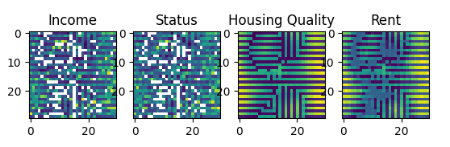
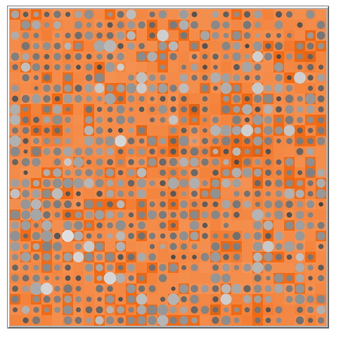

```{r setup, include=FALSE}
knitr::opts_chunk$set(echo = FALSE, 
                      message = FALSE, 
                      warning = FALSE, 
                      error = FALSE,
                      out.width="50%")

label_a <- c(`0` = "Only Quality", `0.5` = "Both Preferences", `1` = "Only Status")
label_r <- c(`0` = "No Cor.", `0.5` = "Medium Cor.", `1` = "Perfect Cor.")
label_d <- c(`0.8` = "d = 0.8", `0.95` = "d = 0.95")
label_seg <- c("Income" = "#E69F00", "Quality" = "#56B4E9", "Status" = "#009E73", "Rent" = "#CC79A7")
```

This document analyses data generated from the NetLogo implementation of the model in R. This serves to make sure that there are no (major) errors in the Python scripts for the model and the analysis. The data analysed here are based on a simulation experiment with a 32x32 grid, a 0.85 population density, a Beta(2, 5) distribution for income and status and no population dynamics. I vary the correlation and preferences preferences with 3 levels (0, 0.5, 1) and the decay parameter with 2 levels (0.95, 0.8). Every of the 9 parameter combinations are repeated 10 times, therefore I simulate 180 runs that go for 200 steps of which I disgard the first 100 as burn-in. 32 x 32 x 180 runs x 100 analysed steps result in about 18 million observations of housing units. I only analyse unit data here.

Additionally, I check whether the size of neighborhoods makes a difference in the analysis. So I create 4x4 and 8x8 neighborhoods to compare the results.

The data preparation was performed on the bwUniCluster2.0 HPC but the analysis in this notebook is executeable on local hardware (16GB RAM, 8 cores i5).


# Data

This section loads required packages and loads the preprocessed simulation data. For the data preparation code, see the separate file. The script does the following: The list output of NetLogo creates a column for each observation at one point in time. But as I export information for all housing units (patches), I need to transform the data to a long format where each row represents one housing unit at one point in time. I then delete information about a renters' (turtles') income and status when there is no turtle in a housing unit. These values are not updated in NetLogo if there is no agent on the patch. I then create neighborhoods of 4x4 and of 8x8 and summarize their characteristics and calculate segregation measures.


```{r packages}
library(nanoparquet)
library(dplyr)
library(tidyr)
library(broom)
library(Hmisc)
library(ggplot2)
library(ggpubr)
library(ggcorrplot)
library(modelsummary)
```

```{r unit_data}
unit_data <- read_parquet("./data/unit_data.parquet")

nb4_data <- read_parquet("./data/nb4_data.parquet")
nb8_data <- read_parquet("./data/nb8_data.parquet")

city4_data <- read_parquet("./data/city4_data.parquet")
city8_data <- read_parquet("./data/city8_data.parquet")
```


# City-Level

## Segregation 

### 4x4 Neighborhoods

```{r seg_4, out.width="100%"}
seg_long <- city4_data %>%
  select(-ends_with("gini")) %>%
  pivot_longer(cols = ends_with("seg"),
               cols_vary = "slowest",
               names_to = "dimension",
               values_to = "segregation") %>%
  mutate(dimension = if_else(dimension == "inc_seg", "Income", dimension),
         dimension = if_else(dimension == "status_seg", "Status", dimension),
         dimension = if_else(dimension == "quality_seg", "Quality", dimension),
         dimension = if_else(dimension == "rent_seg", "Rent", dimension),
         dimension = if_else(dimension == "vacancy_seg", "Vacancy", dimension))

seg_long %>%
  filter(dimension != "Vacancy") %>%
  group_by(a_preferences, r_correlation, d_decay, dimension) %>%
  summarise(segregation = mean(segregation)) %>%
  ggplot() +
  aes(x = a_preferences,
      y = segregation,
      colour = dimension,
      group = dimension) +
  geom_point() +
  geom_line() +
  facet_grid(rows = vars(r_correlation),
             cols = vars(d_decay), 
             labeller = label_both) +
  labs(title = "Segregation, 4x4 Neighborhoods", y = "H^R") +
  theme_bw() +
  theme(legend.position = "bottom")
```

For the most part, the models show very similar results independent of the programming language, in this case, NetLogo and Python (see analysis of the main experiment). However, there is one condition in which the two analyses do not match: 

In the NetLogo model, no stable segregated neighborhoods form (see also results on neighborhood stability) when housing quality decays fast, and households value only housing quality. In this condition, rich households frequently move to another housing unit with better housing quality than their current location, even after one period of no investment.

In the Python model, neighborhoods stay surprisingly stable. The reason is a peculiar phenomenon where patterns in housing quality (and rent) oscillate. At every time step, the previously higher-quality units decay as their quality exceeds the rent average. In contrast, the lower-quality units are invested in because their quality is below the average rent. Due to these oscillations, the neighborhood averages are relatively stable over time, and they are different between neighborhoods, i.e., segregated.

These observations have been made from the animated versions of the model, specifically from the Python code in the Jupyter Notebook. These images of the respective GUIs show the differences between the models in realistic conditions, but with a fast decay (low d). In the NetLogo GUI, dots represent households, with larger sizes indicating higher income and brighter shades indicating higher status. The grid is coloured by housing quality, with higher housing quality being lighter in shade. Rent is not depicted here. In agentpy, yellow represents high values and dark blue low values.



{width=50% height=50%}


I do not have a good explanation for these differences between models. However, I assume that the scheduling "under the hood" is different in the different modeling frameworks. As the pattern in the agentpy model is very particular and highly unrealistic in the real world, I am tempted to give the NetLogo model higher credibility in this instance. Substantially speaking, housing quality inertia is important to explain why stable neighborhoods form when households only value housing quality. If quality decays fast, even after one period of disinvestment, another neighborhood likely provides a higher utility for households, and they move.

The empirically most plausible case is when households value both housing quality and neighborhood status and income and status are correlated. In the fast decay condition, this is even the condition with the highest segregation indices as both mechanisms described above (spatial interdependence via (1) landlords investing in housing quality and (2) households seeking high status neighborhoods) reinforce and stabilize each other. In this model, the combination of the two mechanisms has a much more visible effect than in the main analysis, due to the difference in model behavior described above.


### 8x8 Neighborhoods

```{r seg_8, out.width="100%"}
seg_long <- city8_data %>%
  select(-ends_with("gini")) %>%
  pivot_longer(cols = ends_with("seg"),
               cols_vary = "slowest",
               names_to = "dimension",
               values_to = "segregation") %>%
  mutate(dimension = if_else(dimension == "inc_seg", "Income", dimension),
         dimension = if_else(dimension == "status_seg", "Status", dimension),
         dimension = if_else(dimension == "quality_seg", "Quality", dimension),
         dimension = if_else(dimension == "rent_seg", "Rent", dimension),
         dimension = if_else(dimension == "vacancy_seg", "Vacancy", dimension))

seg_long %>%
  filter(dimension != "Vacancy") %>%
  group_by(a_preferences, r_correlation, d_decay, dimension) %>%
  summarise(segregation = mean(segregation)) %>%
  ggplot() +
  aes(x = a_preferences,
      y = segregation,
      colour = dimension,
      group = dimension) +
  geom_point() +
  geom_line() +
  facet_grid(rows = vars(r_correlation),
             cols = vars(d_decay), 
             labeller = label_both) +
  labs(title = "Segregation, 8x8 Neighborhoods", y = "H^R") +
  theme_bw() +
  theme(legend.position = "bottom")
```

The substantive conclusions are unchanged when considering 8x8 neighborhoods even though the levels of segregation in the indices is reduced. However, this is to be expected because with less and larger neighborhoods, the proportion of variance within neighborhoods relative to variance between neighborhoods needs to increase, see Reardon et al (2008) and Elbers and Gruijters (2024).


## Inequality

```{r ineq}
unit_data %>% 
  filter(time == 150) %>%
  ggplot() +
  aes(x = rent, 
      fill = as.factor(d_decay)) +
  geom_histogram(alpha = 0.6, position = 'identity') +
  facet_grid(rows = vars(r_correlation),
             cols = vars(a_preferences),
             labeller = labeller(.rows = label_r, 
                                 .cols = label_a)) +
  labs(title = "t = 150", fill = "decay", x = "Rent") +
  theme_bw()

unit_data %>% 
  filter(time == 150) %>%
  ggplot() +
  aes(x = quality, 
      fill = as.factor(d_decay)) +
  geom_histogram(alpha = 0.6, position = 'identity') +
  facet_grid(rows = vars(r_correlation),
             cols = vars(a_preferences),
             labeller = labeller(.rows = label_r, 
                                 .cols = label_a)) +
  labs(title = "t = 150", fill = "decay", x = "Housing Quality") +
  theme_bw()

city4_data %>%
  ggplot() +
  geom_bar(aes(x = "Rent", y = rent_gini, fill = as.factor(d_decay)),
           stat = "summary", fun.y = "mean", position = "dodge") +
  geom_bar(aes(x = "Quality", y = quality_gini, fill = as.factor(d_decay)),
           stat = "summary", fun.y = "mean", position = "dodge") +
  facet_grid(rows = vars(r_correlation),
             cols = vars(a_preferences),
             labeller = labeller(.rows = label_r, 
                                 .cols = label_a)) +
  labs(x = "", y = "Gini Index", fill = "decay",
       title = "City-level Inequality") +
  theme_bw() +
  theme(legend.position = "bottom")
```

When looking at the distributions of rents and housing quality within cities at a point in time, different parameter combinations show markedly different results as well. This is interesting, as the income distribution is the same in all cases. Patterns of inequality mirror those of residential segregation: when rent and housing quality is spatially segregated, the mean rent and quality is lower and inequality is higher. 

In the case where households only value status and income and status are uncorrelated, the rich do not necessarily live in the most desirable neighborhoods as high status does not imply high income. Because rent is the 75th percentile of the households living on the best housing units, rents are not as high. And landlords invest based on average rent in the neighborhood, so housing quality shows a similar pattern. Especially because desirable neighborhoods are not stable and there is a chase game where the rich follow the high-status through the neighborhoods, but landlords investment are inert, average housing quality in the city is relatively high.

When households only value housing quality and housing quality is relatively inert, stable neighborhoods occur as described above. This is based on neighborhoods that have a clear and stable hierarchy in housing quality. Necessarily, this requires inequality in housing quality. There are neighborhoods with desirable homes and some with housing units that are left to decay. If housing units are left to decay over a longer period of time, housing quality asymptotically converges to 0. But if there is less inertia in housing quality (d = 0.8), rich households move frequently to better housing elsewhere, where landlords in turn invest. As a result of the frequent investments, average housing quality is high. The higher peak at around 0.42 seems to be a frequent level landlords invest into. The second peak is at about 0.33 which is in fact 80 percent of the former peak. So, as housing units become attractive, landlords invest. If there is no further increase, landlords do not invest and the property retains 80 percent of its quality in the next step. But this drop seems to be overshooting the mark because investing is profitable again. So housing quality oscillates between these two values. Only a few housing units have much lower quality. With the frequent changes in this condition, many less affluent households are still on high quality units lowering prices, therefore rents are pretty uniform.

Only with both preferences/status preferences and a correlation between income and status, rent and housing quality show a spread out, positively skewed distribution we would expect given a positively skewed income distribution. And because of the spatial interdependencies in the investment and residential satisfaction mechanisms, the resulting housing units of different prices and qualities are spatially clustered together. Only when average rent in the neighborhood is more unequal will housing quality become more unequal and only when neighborhood status and housing quality become unequal, rent becomes unequal.


### Segregation and Inequality

```{r corplot}
city4_data %>%
  #filter(r_correlation == 0.5 & a_preferences == 0.5 & d_decay == 0.8) %>%
  select(ends_with("gini"), ends_with("seg")) %>%
  cor() %>%
  ggcorrplot(method = "circle", type = "upper", 
             show.legend = F, lab = T) +
  labs(title = "Correlation Matrix")
```

The correlation matrix then shows more formally how different dimensions of inequality and segregation covary. These are particularly useful to generate empirically testable hypotheses like "a more segregated city should be more unequal in...". 

As income and status are fixed in their distribution, they are less interesting and do not vary between runs. Therefore they show barely any associations to the other measures. One exception is that a higher inequality in status is associated with less income segregation. But this is likely an artefact: the way the status distribution is generated makes it that status is less unequal when it is a composite of two Beta distributions (when income and status are correlated but not perfectly) due to the central limit theorem (see section on neighborhood level). So this association captures a part of the effect of the correlation parameter. Status segregation also has a more moderate positive correlation to the other dimensions of inequality and segregation as status segregation sometimes does not emerge even when segregation and inequality emerges in the others. 

But for most other dimensions, the levels of segregation by income, rent and housing quality as well as inequality in rent and housing quality correlate highly with each other.


# Neighborhood Level

## Income and Status

Income and status of agents are fixed and sampled from the same distribution in all runs. But status is sampled conditional on income if the r parameter i greater 0. For reference, the first graphic shows the overall distribution of income, perfectly reflecting the underlying Beta(2, 5) distribution. The distribution of status reflects the Beta(2, 5) if r is 0 or 1, but is slightly different when the distribution results from two separate draws from the original distribution. This is to be expected by the central limit theorem as sums of two random variables approach a normal distribution as do means.

```{r descr}
unit_data %>% 
  filter(time == 150) %>%
  ggplot() +
  aes(status) +
  geom_histogram() +
  facet_wrap(~r_correlation) +
  labs(x = "Individual Status by r Parameter") +
  theme_bw()
```

In comparison, the following images show average income and status in the neighborhoods in the segregated state.

### 4x4 Neighborhoods

```{r nb4_descr}
nb4_data %>% 
  filter(time == 150) %>%
  ggplot() +
  aes(x = ave_inc, 
      fill = as.factor(d_decay)) +
  geom_histogram(alpha = 0.6, position = 'identity') +
  facet_grid(rows = vars(r_correlation),
             cols = vars(a_preferences),
             labeller = labeller(.rows = label_r, 
                                 .cols = label_a)) +
  labs(title = "t = 150", fill = "decay", x = "Average Neighborhood Income") +
  theme_bw()

nb4_data %>% 
  filter(time == 150) %>%
  ggplot() +
  aes(x = ave_status,
      fill = as.factor(d_decay)) +
  geom_histogram(alpha = 0.6, position = 'identity') +
  facet_grid(rows = vars(r_correlation),
             cols = vars(a_preferences),
             labeller = labeller(.rows = label_r, 
                                 .cols = label_a)) +
  labs(title = "t = 150", fill = "decay", x = "Average Neighborhood Status") +
  theme_bw()
```


### 8x8 Neighborhoods

```{r nb8_descr}
nb8_data %>% 
  filter(time == 150) %>%
  ggplot() +
  aes(x = ave_inc, 
      fill = as.factor(d_decay)) +
  geom_histogram(alpha = 0.6, position = 'identity') +
  facet_grid(rows = vars(r_correlation),
             cols = vars(a_preferences),
             labeller = labeller(.rows = label_r, 
                                 .cols = label_a)) +
  labs(title = "t = 150", fill = "decay", x = "Average Neighborhood Income") +
  theme_bw()

nb8_data %>% 
  filter(time == 150) %>%
  ggplot() +
  aes(x = ave_status,
      fill = as.factor(d_decay)) +
  geom_histogram(alpha = 0.6, position = 'identity') +
  facet_grid(rows = vars(r_correlation),
             cols = vars(a_preferences),
             labeller = labeller(.rows = label_r, 
                                 .cols = label_a)) +
  labs(title = "t = 150", fill = "decay", x = "Average Neighborhood Status") +
  theme_bw()
```

These distributions are just a different way to visualize residential segregation by income and status as they have been discussed before. Essentially, segregation is a variance decomposition. The total variance of income and status is separated into the variance within neighborhoods and the variance between neighborhoods. Segregation indices (more or less) present the proportion of between neighborhood variance relative to the total variance. If all variance is between neighborhoods, a city is fully segregated and the neighborhoods are totally homogenous (Reardon et al 2006: 9f). In this depiction, if the neighborhood averages cover the entire range of the income/status distribution, the neighborhoods are segregated. If the neighborhoods are not segregated, they should form a normal distribution around their mean (CLT again). In the 8x8 neighborhoods, the spread in averages is lower as the spread from the true mean (essentially: standard errors) decrease with the square root of n and the 8x8 neighborhoods have a higher population than the 4x4, obviously.


## Housing Quality and Rent

The remark above applies here as well: these results are identical to the results from the segregation indices.

### 4x4 Neighborhoods

```{r nb4_hists}
nb4_data %>% 
  filter(time == 150) %>%
  ggplot() +
  aes(x = ave_quality, 
      fill = as.factor(d_decay)) +
  geom_histogram(alpha = 0.6, position = 'identity') +
  facet_grid(rows = vars(r_correlation),
             cols = vars(a_preferences),
             labeller = labeller(.rows = label_r, 
                                 .cols = label_a)) +
  labs(title = "t = 150", fill = "decay", x = "Average Neighborhood Housing Quality") +
  theme_bw()

nb4_data %>% 
  filter(time == 150) %>%
  ggplot() +
  aes(x = ave_rent, 
      fill = as.factor(d_decay)) +
  geom_histogram(alpha = 0.6, position = 'identity') +
  facet_grid(rows = vars(r_correlation),
             cols = vars(a_preferences),
             labeller = labeller(.rows = label_r, 
                                 .cols = label_a)) +
  labs(title = "t = 150", fill = "decay", x = "Average Neighborhood Rent") +
  theme_bw()
```

### 8x8 Neighborhoods

```{r nb8_hists}
nb8_data %>% 
  filter(time == 150) %>%
  ggplot() +
  aes(x = ave_quality, 
      fill = as.factor(d_decay)) +
  geom_histogram(alpha = 0.6, position = 'identity') +
  facet_grid(rows = vars(r_correlation),
             cols = vars(a_preferences),
             labeller = labeller(.rows = label_r, 
                                 .cols = label_a)) +
  labs(title = "t = 150", fill = "decay", x = "Average Neighborhood Housing Quality") +
  theme_bw()

nb8_data %>% 
  filter(time == 150) %>%
  ggplot() +
  aes(x = ave_rent, 
      fill = as.factor(d_decay)) +
  geom_histogram(alpha = 0.6, position = 'identity') +
  facet_grid(rows = vars(r_correlation),
             cols = vars(a_preferences),
             labeller = labeller(.rows = label_r, 
                                 .cols = label_a)) +
  labs(title = "t = 150", fill = "decay", x = "Average Neighborhood Rent") +
  theme_bw()
```


## Neighborhood Stability

### 4x4 Neighborhoods

```{r nb4_stability}
stability4_data <- nb4_data %>%
  group_by(run, r_correlation, a_preferences, d_decay, nb_4) %>%
  summarise(ave_rank_inc = mean(rank_inc),
            sd_rank_inc = sd(rank_inc),
            ave_rank_status = mean(rank_status),
            sd_rank_status = sd(rank_status),
            ave_rank_quality = mean(rank_quality),
            sd_rank_quality = sd(rank_quality),
            ave_rank_rent = mean(rank_rent),
            sd_rank_rent = sd(rank_rent))

ggplot(stability4_data) +
  aes(x = ave_rank_inc,
      y = sd_rank_inc,
      colour = as.factor(d_decay)) +
  geom_point(size = 0.1) +
  geom_smooth() +
  facet_grid(rows = vars(r_correlation),
             cols = vars(a_preferences),
             labeller = labeller(.rows = label_r, 
                                 .cols = label_a)) +
  labs(x = "Mean(Rank)",
       y = "SD(Rank)",
       title = "Neighborhood Stability by Income",
       colour = "decay") +
  theme_bw() +
  theme(legend.position = "bottom")

ggplot(stability4_data) +
  aes(x = ave_rank_status,
      y = sd_rank_status,
      colour = as.factor(d_decay)) +
  geom_point(size = 0.1) +
  geom_smooth() +
  facet_grid(rows = vars(r_correlation),
             cols = vars(a_preferences),
             labeller = labeller(.rows = label_r, 
                                 .cols = label_a)) +
  labs(x = "Mean(Rank)",
       y = "SD(Rank)",
       title = "Neighborhood Stability by Status",
       colour = "decay") +
  theme_bw() +
  theme(legend.position = "bottom")

ggplot(stability4_data) +
  aes(x = ave_rank_quality,
      y = sd_rank_quality,
      colour = as.factor(d_decay)) +
  geom_point(size = 0.1) +
  geom_smooth() +
  facet_grid(rows = vars(r_correlation),
             cols = vars(a_preferences),
             labeller = labeller(.rows = label_r, 
                                 .cols = label_a)) +
  labs(x = "Mean(Rank)",
       y = "SD(Rank)",
       title = "Neighborhood Stability by Quality",
       colour = "decay") +
  theme_bw() +
  theme(legend.position = "bottom")

ggplot(stability4_data) +
  aes(x = ave_rank_rent,
      y = sd_rank_rent,
      colour = as.factor(d_decay)) +
  geom_point(size = 0.1) +
  geom_smooth() +
  facet_grid(rows = vars(r_correlation),
             cols = vars(a_preferences),
             labeller = labeller(.rows = label_r, 
                                 .cols = label_a)) +
  labs(x = "Mean(Rank)",
       y = "SD(Rank)",
       title = "Neighborhood Stability by Rent",
       colour = "decay") +
  theme_bw() +
  theme(legend.position = "bottom")
```

To assess neighborhood stability, I have calculated the rank each neighbourhood occupies at a point in time within their city according to their neighborhood average income, status, housing quality and rent. When neighborhoods are stable, we should only see limited variation in rank over time. 

The plots show the standard deviation of rank over time for neighborhoods in cities (simulation runs) with the same parameter combinations. To get a sense of which neighborhoods change rank if at all, I plotted their mean neighborhood income/status/quality/rent over time. As a general observation: if changes in rank are not rare for all neighborhoods, the neighborhoods at the extremes of the respective distributions have less changes in rank than the middle of the distribution. So, high and low income, high- and low status, high- and low quality and high- and low rent neighborhoods are more stable over time. But the overall levels of neighborhood change are markedly different by parameter combinations. 

When only status is valued by households and income and status are uncorrelated, the rich want to live next to the high status households but displace them via rent increases, because of which landlords invest. No stable neighborhoods form and all neighborhoods change their rank frequently. Additionally, there is not much variation in mean rank over time as the mean averages out the times where a specific neighborhood was on top or on the bottom.

Similarly, when households value only housing quality but quality decays fast, households move frequently to better housing. Therefore, neighborhoods are relatively unstable and change often. When housing quality decays slowly, the system has a lot of inertia and the neighborhoods with a given level of quality housing and therefore rents and incomes of residents remain the same over time. Only the rank by status changes frequently when it is not correlated with income as status is not important. This indicates though that households still do move, but neighborhoods stay stable nonetheless. But the top and bottom neighborhoods in status do barely change even in this condition. 

In the other conditions, neighborhoods are very stable over time. When a city is more segregated, the neighborhoods remain in a stable segregated state. There are only a few outliers when status and income are perfectly correlated, for which I have no explanation, but they do not affect the LOESS curve much.

### 8x8 Neighborhoods

```{r nb8_stability}
stability8_data <- nb8_data %>%
  group_by(run, r_correlation, a_preferences, d_decay, nb_8) %>%
  summarise(ave_rank_inc = mean(rank_inc),
            sd_rank_inc = sd(rank_inc),
            ave_rank_status = mean(rank_status),
            sd_rank_status = sd(rank_status),
            ave_rank_quality = mean(rank_quality),
            sd_rank_quality = sd(rank_quality),
            ave_rank_rent = mean(rank_rent),
            sd_rank_rent = sd(rank_rent))

ggplot(stability8_data) +
  aes(x = ave_rank_inc,
      y = sd_rank_inc,
      colour = as.factor(d_decay)) +
  geom_point(size = 0.1) +
  geom_smooth() +
  facet_grid(rows = vars(r_correlation),
             cols = vars(a_preferences),
             labeller = labeller(.rows = label_r, 
                                 .cols = label_a)) +
  labs(x = "Mean(Rank)",
       y = "SD(Rank)",
       title = "Neighborhood Stability by Income",
       colour = "decay") +
  theme_bw() +
  theme(legend.position = "bottom")

ggplot(stability8_data) +
  aes(x = ave_rank_status,
      y = sd_rank_status,
      colour = as.factor(d_decay)) +
  geom_point(size = 0.1) +
  geom_smooth() +
  facet_grid(rows = vars(r_correlation),
             cols = vars(a_preferences),
             labeller = labeller(.rows = label_r, 
                                 .cols = label_a)) +
  labs(x = "Mean(Rank)",
       y = "SD(Rank)",
       title = "Neighborhood Stability by Status",
       colour = "decay") +
  theme_bw() +
  theme(legend.position = "bottom")

ggplot(stability8_data) +
  aes(x = ave_rank_quality,
      y = sd_rank_quality,
      colour = as.factor(d_decay)) +
  geom_point(size = 0.1) +
  geom_smooth() +
  facet_grid(rows = vars(r_correlation),
             cols = vars(a_preferences),
             labeller = labeller(.rows = label_r, 
                                 .cols = label_a)) +
  labs(x = "Mean(Rank)",
       y = "SD(Rank)",
       title = "Neighborhood Stability by Quality",
       colour = "decay") +
  theme_bw() +
  theme(legend.position = "bottom")

ggplot(stability8_data) +
  aes(x = ave_rank_rent,
      y = sd_rank_rent,
      colour = as.factor(d_decay)) +
  geom_point(size = 0.1) +
  geom_smooth() +
  facet_grid(rows = vars(r_correlation),
             cols = vars(a_preferences),
             labeller = labeller(.rows = label_r, 
                                 .cols = label_a)) +
  labs(x = "Mean(Rank)",
       y = "SD(Rank)",
       title = "Neighborhood Stability by Rent",
       colour = "decay") +
  theme_bw() +
  theme(legend.position = "bottom")
```

The results for the 8x8 neighborhoods largely reflect the results from the 4x4 neighborhoods. Although it is difficult to assess, as the variability of ranks has a different meaning because there are less ranks, the lack of the anomalies in the perfect correlation condition would suggest that neighborhoods are more stable when larger units are used.

# Vacant Housing

In the agent-based models, I set the vacancy rate to 1 - 0.85 = 0.15 (here with random differences). But how are these empty units distributed over the neighborhoods? 

```{r descr_vac}
nb4_data %>% 
  filter(time == 150) %>%
  ggplot() +
  aes(x = 1 - ave_vacant,
      fill = as.factor(d_decay)) +
  geom_histogram(alpha = 0.6, position = 'identity') +
  facet_grid(rows = vars(r_correlation),
             cols = vars(a_preferences),
             labeller = labeller(.rows = label_r, 
                                 .cols = label_a)) +
  labs(title = "t = 150, 4x4 Neighborhoods", fill = "decay",
       x = "Average Neighborhood Vacancy Rate") +
  theme_bw() +
  theme(legend.position = "bottom")

nb8_data %>% 
  filter(time == 150) %>%
  ggplot() +
  aes(x = 1 - ave_vacant,
      fill = as.factor(d_decay)) +
  geom_histogram(alpha = 0.6, position = 'identity') +
  facet_grid(rows = vars(r_correlation),
             cols = vars(a_preferences),
             labeller = labeller(.rows = label_r, 
                                 .cols = label_a)) +
  labs(title = "t = 150, 8x8 Neighborhoods", fill = "decay",
       x = "Average Neighborhood Vacancy Rate") +
  theme_bw() +
  theme(legend.position = "bottom")
```

Under random chance, we would expect that neighborhood vacancy rates are normally distributed around the global vacancy rate of 15 percent. This is rarely the case - only when status and income are uncorrelated and status matters for residential satisfaction or only housing quality matters but decays fast. Otherwise, most neighborhoods have no vacancies. This implies that vacant housing is distributed unequally in space.


## Segregation

```{r unit_data_vacancy}
ggplot(city4_data) +
  aes(x = as.factor(d_decay),
      y = vacancy_seg,
      fill = as.factor(d_decay)) +
  geom_bar(stat = "summary", fun.y = "mean") +
  facet_grid(rows = vars(r_correlation),
             cols = vars(a_preferences),
             labeller = labeller(.rows = label_r, 
                                 .cols = label_a)) +
  labs(x = "", y = "Theil Index", fill = "decay",
       title = "Vacancy Segregation, 4x4 Neighborhoods") +
  scale_x_discrete(breaks = NULL) +
  theme_bw() +
  theme(legend.position = "bottom")

ggplot(city8_data) +
  aes(x = as.factor(d_decay),
      y = vacancy_seg,
      fill = as.factor(d_decay)) +
  geom_bar(stat = "summary", fun.y = "mean") +
  facet_grid(rows = vars(r_correlation),
             cols = vars(a_preferences),
             labeller = labeller(.rows = label_r, 
                                 .cols = label_a)) +
  labs(x = "", y = "Theil Index", fill = "decay",
       title = "Vacancy Segregation, 8x8 Neighborhoods") +
  scale_x_discrete(breaks = NULL) +
  theme_bw() +
  theme(legend.position = "bottom")
```

And as we can see, in many conditions are the vacant housing units spatially clustered, typically in the conditions where segregation occurs in other dimensions as well. This has already been revealed by the correlation plot previously where vacancy segregation has very high correlations with the other segregation dimensions (except status as it is not always segregated).


## Neighborhood Characteristics

### 4x4 Neighborhoods

```{r character_empty}
nb4_data %>%
  filter(d_decay == 0.95) %>%
  ggplot() +
  geom_smooth(aes(x = ave_inc,
                  y = 1 - ave_vacant,
                  colour = "Income")) +
  geom_smooth(aes(x = ave_status,
                  y = 1 - ave_vacant,
                  colour = "Status")) +
  geom_smooth(aes(x = ave_quality,
                  y = 1 - ave_vacant,
                  colour = "Quality")) +
  geom_smooth(aes(x = ave_rent,
                  y = 1 - ave_vacant,
                  colour = "Rent")) +
  facet_grid(rows = vars(r_correlation),
             cols = vars(a_preferences),
             labeller = labeller(.rows = label_r, 
                                 .cols = label_a)) +
  labs(x = "", y = "Neighborhood Vacancy Rate", 
       colour = "", title = "decay = 0.95") +
  scale_colour_manual(values = label_seg) +
  theme_bw() +
  theme(legend.position = "bottom")

nb4_data %>%
  filter(d_decay == 0.8) %>%
  ggplot() +
  geom_smooth(aes(x = ave_inc,
                  y = 1 - ave_vacant,
                  colour = "Income")) +
  geom_smooth(aes(x = ave_status,
                  y = 1 - ave_vacant,
                  colour = "Status")) +
  geom_smooth(aes(x = ave_quality,
                  y = 1 - ave_vacant,
                  colour = "Quality")) +
  geom_smooth(aes(x = ave_rent,
                  y = 1 - ave_vacant,
                  colour = "Rent")) +
  facet_grid(rows = vars(r_correlation),
             cols = vars(a_preferences),
             labeller = labeller(.rows = label_r, 
                                 .cols = label_a)) +
  labs(x = "", y = "Neighborhood Vacancy Rate", 
       colour = "", title = "decay = 0.8") +
  scale_colour_manual(values = label_seg) +
  theme_bw() +
  theme(legend.position = "bottom")
```

### 8x8 Neighborhoods

```{r character8_empty}
nb8_data %>%
  filter(d_decay == 0.95) %>%
  ggplot() +
  geom_smooth(aes(x = ave_inc,
                  y = 1 - ave_vacant,
                  colour = "Income")) +
  geom_smooth(aes(x = ave_status,
                  y = 1 - ave_vacant,
                  colour = "Status")) +
  geom_smooth(aes(x = ave_quality,
                  y = 1 - ave_vacant,
                  colour = "Quality")) +
  geom_smooth(aes(x = ave_rent,
                  y = 1 - ave_vacant,
                  colour = "Rent")) +
  facet_grid(rows = vars(r_correlation),
             cols = vars(a_preferences),
             labeller = labeller(.rows = label_r, 
                                 .cols = label_a)) +
  labs(x = "", y = "Neighborhood Vacancy Rate", 
       colour = "", title = "decay = 0.95") +
  scale_colour_manual(values = label_seg) +
  theme_bw() +
  theme(legend.position = "bottom")

nb8_data %>%
  filter(d_decay == 0.8) %>%
  ggplot() +
  geom_smooth(aes(x = ave_inc,
                  y = 1 - ave_vacant,
                  colour = "Income")) +
  geom_smooth(aes(x = ave_status,
                  y = 1 - ave_vacant,
                  colour = "Status")) +
  geom_smooth(aes(x = ave_quality,
                  y = 1 - ave_vacant,
                  colour = "Quality")) +
  geom_smooth(aes(x = ave_rent,
                  y = 1 - ave_vacant,
                  colour = "Rent")) +
  facet_grid(rows = vars(r_correlation),
             cols = vars(a_preferences),
             labeller = labeller(.rows = label_r, 
                                 .cols = label_a)) +
  labs(x = "", y = "Neighborhood Vacancy Rate", 
       colour = "", title = "decay = 0.8") +
  scale_colour_manual(values = label_seg) +
  theme_bw() +
  theme(legend.position = "bottom")
```

Which neighborhoods are empty? When there are no distinct differences in vacancy rates between neighborhoods, the average income/status/quality/rent of the neighborhood has obviously no relationship to the vacancy rate. But otherwise, the neighborhoods with higher vacancies tend to have lower average income/status/quality/rent. All households that can afford a neighborhood with a given status and/or housing quality of a unit want to move there. When they move to a better unit, they leave a vacancy in their old unit If this unit is attractive to another household, for which this unit is within their budget, they fill this vacancy. But again they create a vacancy in their even worse previous unit. This continues as the least desirable units are left vacant. If the least desirable units are concentrated in space, which they usually are as investments in housing quality and neighbourhood desirability are spatially interdependent, entire neighborhoods remain vacant. Only those with no other options will move to these neighborhoods, which are households at the very end of the income and status distribution.


## Neighborhood Stability

```{r stab_vac}
nb4_data %>%
  group_by(run, r_correlation, a_preferences, d_decay, nb_4) %>%
  summarise(ave_rank_vac = mean(rank_vacant),
            sd_rank_vac = sd(rank_vacant)) %>%
  ggplot() +
  aes(x = ave_rank_vac,
      y = sd_rank_vac,
      colour = as.factor(d_decay)) +
  geom_point(size = 0.1) +
  facet_grid(rows = vars(r_correlation),
             cols = vars(a_preferences),
             labeller = labeller(.rows = label_r, 
                                 .cols = label_a)) +
  labs(x = "Average Neighborhood Rank by Occupation Rate",
       y = "SD of Rank by Occupation Rate", colour = "decay",
       title = "4x4 Neighbourhoods") +
  theme_bw() +
  theme(legend.position = "bottom")

nb8_data %>%
  group_by(run, r_correlation, a_preferences, d_decay, nb_8) %>%
  summarise(ave_rank_vac = mean(rank_vacant),
            sd_rank_vac = sd(rank_vacant)) %>%
  ggplot() +
  aes(x = ave_rank_vac,
      y = sd_rank_vac,
      colour = as.factor(d_decay)) +
  geom_point(size = 0.1) +
  facet_grid(rows = vars(r_correlation),
             cols = vars(a_preferences),
             labeller = labeller(.rows = label_r, 
                                 .cols = label_a)) +
  labs(x = "Average Neighborhood Rank by Occupation Rate",
       y = "SD of Rank by Occupation Rate", colour = "decay",
       title = "8x8 Neighbourhoods") +
  theme_bw() +
  theme(legend.position = "bottom")
```

I accidentally calculated the inverse of the vacancy rates for these plots. The occupation rate is 1 - vacancy rate. However, changes in the vacancy rate are identical to the occupation rate, the ranking is just reversed. Here we see again that, if stable segregated neighborhoods form, they remain stable. While there are occasionally some vacancies in mid-level neighborhoods that are also quickly filled, neighborhoods at the top and bottom of the vacancy rate ranks rarely change their vacancy rate over time. If you are living in the most desirable neighborhood, you are not going to move out as there is no place that would improve your residential satisfaction. So there are rarely vacancies in the top neighborhoods. At the bottom of the distributions, these neighborhoods are so undesirable that no one wants to move there. These neighborhoods have high vacancy rates throughout.


# Individual Level


## Housing Inequality by Income

```{r indiv}
unit_data %>%
  filter(d_decay == 0.95) %>%
  ggplot() +
  aes(x = income,
      y = quality) +
  geom_bin_2d() +
  facet_grid(rows = vars(r_correlation),
             cols = vars(a_preferences),
             labeller = labeller(.rows = label_r, 
                                 .cols = label_a)) +
  labs(x = "Income", y = "Housing Quality",
       title = "decay = 0.95") +
  theme_bw() +
  theme(legend.position = "bottom")

unit_data %>%
  filter(d_decay == 0.8) %>%
  ggplot() +
  aes(x = income,
      y = quality) +
  geom_bin_2d() +
  facet_grid(rows = vars(r_correlation),
             cols = vars(a_preferences),
             labeller = labeller(.rows = label_r, 
                                 .cols = label_a)) +
  labs(x = "Income", y = "Housing Quality",
       title = "decay = 0.8") +
  theme_bw() +
  theme(legend.position = "bottom")

unit_data %>%
  filter(d_decay == 0.95) %>%
  ggplot() +
  aes(x = income,
      y = rent) +
  geom_bin_2d() +
  facet_grid(rows = vars(r_correlation),
             cols = vars(a_preferences),
             labeller = labeller(.rows = label_r, 
                                 .cols = label_a)) +
  labs(x = "Income", y = "Rent",
       title = "decay = 0.95") +
  theme_bw() +
  theme(legend.position = "bottom")

unit_data %>%
  filter(d_decay == 0.8) %>%
  ggplot() +
  aes(x = income,
      y = rent) +
  geom_bin_2d() +
  facet_grid(rows = vars(r_correlation),
             cols = vars(a_preferences),
             labeller = labeller(.rows = label_r, 
                                 .cols = label_a)) +
  labs(x = "Income", y = "Rent",
       title = "decay = 0.8") +
  theme_bw() +
  theme(legend.position = "bottom")

unit_data %>%
  filter(d_decay == 0.95) %>%
  ggplot() +
  aes(x = income,
      y = log(rent / income)) +
  geom_bin_2d() +
  geom_hline(yintercept = 1, colour = "red") +
  facet_grid(rows = vars(r_correlation),
             cols = vars(a_preferences),
             labeller = labeller(.rows = label_r, 
                                 .cols = label_a)) +
  labs(x = "Income", y = "Log(Rent/Income)",
       title = "decay = 0.95") +
  theme_bw() +
  theme(legend.position = "bottom")

unit_data %>%
  filter(d_decay == 0.8) %>%
  ggplot() +
  aes(x = income,
      y = log(rent / income)) +
  geom_bin_2d() +
  geom_hline(yintercept = 1, colour = "red") +
  facet_grid(rows = vars(r_correlation),
             cols = vars(a_preferences),
             labeller = labeller(.rows = label_r, 
                                 .cols = label_a)) +
  labs(x = "Income", y = "Log(Rent/Income)",
       title = "decay = 0.8") +
  theme_bw() +
  theme(legend.position = "bottom")
```

As seen at the city level, pronounced segregation coincides with an increased level of inequality in housing quality and rent. As households need to be able to afford their unit, and rent is higher for more desirable units, richer households tend to have higher housing quality because they can outprice the other households. In turn, they need to pay more rent. But when only status matters and there is no status-income correlation or housing quality is the primary concern but unstable, there is less differences in housing quality between households. But while rich households pay higher absolute rents, they pay a lower proportion of their budget for rent while for very poor households, it is common to pay more than they can afford. That rent exceeds income is more common for parameter conditions where no stable neighborhoods form though: as neighborhoods become more desirable, the old population is faced with rent increases. Unaffordability triggers residential mobility (see below).


## Housing Inequality by Status

```{r status_quality}
unit_data %>%
  filter(d_decay == 0.95) %>%
  ggplot() +
  aes(x = status,
      y = quality) +
  geom_bin_2d() +
  facet_grid(rows = vars(r_correlation),
             cols = vars(a_preferences),
             labeller = labeller(.rows = label_r, 
                                 .cols = label_a)) +
  labs(x = "Status", y = "Housing Quality",
       title = "decay = 0.95") +
  theme_bw() +
  theme(legend.position = "bottom")

unit_data %>%
  filter(d_decay == 0.8) %>%
  ggplot() +
  aes(x = status,
      y = quality) +
  geom_bin_2d() +
  facet_grid(rows = vars(r_correlation),
             cols = vars(a_preferences),
             labeller = labeller(.rows = label_r, 
                                 .cols = label_a)) +
  labs(x = "Status", y = "Housing Quality",
       title = "decay = 0.8") +
  theme_bw() +
  theme(legend.position = "bottom")
```


The binned scatterplots also show that there is a positive relationship between status and housing quality. But as status and income are correlated, this is to be expected. Are low status households living in worse housing units after controlling for their income? To answer this, I perform separate regressions of quality on status for the different parameter conditions controlling or income. Perfect correlation is left out because of collinearity.

```{r reg_quality}
reg_quality <- unit_data %>%
  nest_by(a_preferences, r_correlation, d_decay) %>%
  mutate(trivariate = list(lm(data = data, quality ~ income + status))) %>%
  reframe(tidy(trivariate)) %>%
  filter(r_correlation != 1 & term == "status") %>%
  select(-statistic, -p.value) %>%
  rename(beta = estimate,
         se = std.error)

ggplot(reg_quality) +
  aes(x = as.factor(a_preferences),
      y = beta,
      ymin = beta - 3.1 * se,
      ymax = beta + 3.1 * se) +
  geom_errorbar(size = 2, width = 0, position = position_dodge(width = 0.5)) +
  geom_hline(yintercept = 0,
             colour = "darkgrey") +
  facet_grid(rows = vars(r_correlation),
             cols = vars(d_decay), 
             labeller = label_both) +
  labs(x = "a_preferences", y = "Coefficient of Status w. 99.9% CI",
       title = "Linear Regression of Housing Quality on Status and Income") +
  theme_bw() +
  theme(legend.position = "bottom")
```

Indeed, status has a significant positive association with housing quality after controlling for income, but only when status matters for residential satisfaction. The reason is that low status households themselves decrease the desirability and subsequently rents of the neighborhood they live in. As landlords invest based on average rent in the neighborhood, housing quality is lower in neighborhoods with low status households compared to neighborhoods with similar incomes but higher status.


## Neighborhood Inequality

Certain groups likely not only have lower quality housing but also less favourable neighborhoods. These plots show that under the more realistic parameter conditions, affluent households tend to live in higher status neighborhoods.

```{r nb_ineq}
unit_data <- full_join(unit_data, nb4_data,
                       by = c("run", "r_correlation", "a_preferences", "d_decay", "time", "nb_4"))

unit_data %>%
  filter(d_decay == 0.95) %>%
  ggplot() +
  aes(x = income,
      y = ave_status) +
  geom_bin_2d() +
  facet_grid(rows = vars(r_correlation),
             cols = vars(a_preferences),
             labeller = labeller(.rows = label_r, 
                                 .cols = label_a)) +
  labs(x = "Income", y = "Average Neighborhood Status",
       title = "decay = 0.95") +
  theme_bw() +
  theme(legend.position = "bottom")

unit_data %>%
  filter(d_decay == 0.8) %>%
  ggplot() +
  aes(x = ave_status,
      y = quality) +
  geom_bin_2d() +
  facet_grid(rows = vars(r_correlation),
             cols = vars(a_preferences),
             labeller = labeller(.rows = label_r, 
                                 .cols = label_a)) +
  labs(x = "Income", y = "Average Neighborhood Status",
       title = "decay = 0.8") +
  theme_bw() +
  theme(legend.position = "bottom")
```


# Residential Mobility

## Mobility between Units

The model, as other models of self-organizing residential segregation, relies on assumptions about residential choice and residential mobility. As such, these models should make prediction / reproduce stylized facts about residential mobility. I am able to measure mobility by checking whether a household lives on the same unit at time t as they do in t-1. I summarize for each household within each run, how often they move. Divided by the number of time points, this gives the probability of moving while the model is already in equilibrium.

Moves can have two reasons: (1) there is an affordable vacant unit the household can move to that increases the households' residential satisfaction or (2) the household cannot afford their current location anymore. Together with the information on whose rent is over their budget from before, I am able to say who is likely to move for which reason.

```{r res_mob}
indiv_data <- unit_data %>%
  filter(!is.na(id)) %>%
  arrange(run, r_correlation, a_preferences, d_decay, id, time) %>%
  group_by(run, r_correlation, a_preferences, d_decay, id) %>%
  summarise(prob_move_unit = mean(x != Lag(x) & y != Lag(y), na.rm = TRUE),
            prob_move_nb4 = mean(nb_4 != Lag(nb_4), na.rm = TRUE),
            prob_move_nb8 = mean(nb_8 != Lag(nb_8), na.rm = TRUE),
            income = mean(income),
            status = mean(status)) %>%
  ungroup()

ggplot(indiv_data) +
  aes(x = income,
      y = prob_move_unit,
      colour = as.factor(d_decay)) +
  geom_smooth() +
  facet_grid(rows = vars(r_correlation),
             cols = vars(a_preferences),
             labeller = labeller(.rows = label_r, 
                                 .cols = label_a)) +
  labs(x = "Income", y = "Probability of Moving", colour = "decay") +
  theme_bw() +
  theme(legend.position = "bottom")

ggplot(indiv_data) +
  aes(x = status,
      y = prob_move_unit,
      colour = as.factor(d_decay)) +
  geom_smooth() +
  facet_grid(rows = vars(r_correlation),
             cols = vars(a_preferences),
             labeller = labeller(.rows = label_r, 
                                 .cols = label_a)) +
  labs(x = "Status", y = "Probability of Moving", colour = "decay") +
  theme_bw() +
  theme(legend.position = "bottom")
```

The results show that usually high income households rarely move while poor households have a considerable chance to move every time step. The exceptions to this patterns are the cases where no stable neighborhoods form. In these cases, even rich households move often as they can secure better housing quality elsewhere when housing quality decays fast or because they follow high-status households. As only very poor households tend to overspend, at least a part of the high residential mobility of the poor is by displacement and not by choice. Interestingly, in same parameter combinations, it is not the poorest that have the highest residential mobility. This indicates that they are living already in the cheapest housing and cannot move, even when they overpay. They are "stuck in place". However, this model does not include eviction and homelessness, so this observation may not hold empirically.


```{r reg_mob}
reg_quality <- indiv_data %>%
  nest_by(a_preferences, r_correlation, d_decay) %>%
  mutate(trivariate = list(lm(data = data, prob_move_unit ~ income + status))) %>%
  reframe(tidy(trivariate)) %>%
  filter(r_correlation != 1 & term == "status") %>%
  select(-statistic, -p.value) %>%
  rename(beta = estimate,
         se = std.error)

ggplot(reg_quality) +
  aes(x = as.factor(a_preferences),
      y = beta,
      ymin = beta - 3.1 * se,
      ymax = beta + 3.1 * se) +
  geom_errorbar(size = 2, width = 0, position = position_dodge(width = 0.5)) +
  geom_hline(yintercept = 0,
             colour = "darkgrey") +
  facet_grid(rows = vars(r_correlation),
             cols = vars(d_decay), 
             labeller = label_both) +
  labs(x = "a_preferences", y = "Coefficient of Status w. 99.9% CI",
       title = "Linear Regression of Housing Quality on Status and Income") +
  theme_bw() +
  theme(legend.position = "bottom")
```

The pattern of residential mobility follows closely the pattern by income, except in the "chase game" conditions. To control for the correlation of status and income, I again use trivariate regressions. When only housing quality matters and income and sttus are uncorrelated, there is no relationship between status and residential mobility. When status matters and there is no correlation, a higher status is positively associated with residential mobility as high status individuals are constantly followed by rich households but displaced by rent increased. This chase game explains the positive association of both income and status with residential mobility. The empirically most plausible cases where neighborhood status matters and there is a correlation, income and status each have an independent negative association with residential mobility. As the plots show that high income and status households barely move, this implies that it is lower income and lower status tat have a higher residential mobility. So, low status households have a greater housing security even after controlling for income. As they also have higher rent burdens, this housing insecurity is likely involuntary.


## Mobility between Neighborhoods


```{r nb8_mob}
ggplot(indiv_data) +
  aes(x = income,
      y = prob_move_nb8,
      colour = as.factor(d_decay)) +
  geom_smooth() +
  facet_grid(rows = vars(r_correlation),
             cols = vars(a_preferences),
             labeller = labeller(.rows = label_r, 
                                 .cols = label_a)) +
  labs(x = "Income", y = "Probability of Moving Neighborhood", colour = "decay") +
  theme_bw() +
  theme(legend.position = "bottom")

ggplot(indiv_data) +
  aes(x = status,
      y = prob_move_nb8,
      colour = as.factor(d_decay)) +
  geom_smooth() +
  facet_grid(rows = vars(r_correlation),
             cols = vars(a_preferences),
             labeller = labeller(.rows = label_r, 
                                 .cols = label_a)) +
  labs(x = "Status", y = "Probability of Moving Neighborhood", colour = "decay") +
  theme_bw() +
  theme(legend.position = "bottom")
```

The mobility between neighborhoods is pretty much identical than mobility between units with 8x8 neighborhoods. This suggests that households typically also move neighborhood when they move housing unit. This is less consistent with empirical evidence but might be in part due t the relatively small size of neighborhoods in this analysis. The probability of a vacant unit in ones neighborhood is quite low.


# Conclusion

Overall, the model as implemented in NetLogo and analysed in R is able generate considerable levels of residential segregation under certain parameter conditions and reproduces many stylized facts in urban and neighborhood research as well as inequalities documented in the literature on housing and residential mobility. Crucially, under the empirically most plausible case that income and status of households are correlated and that households value both neighborhood status and housing quality as well as housing decaying only slowly without investments, the model consistently reproduces stylized facts. Indeed, these parameter conditions are the only condition where the stylized facts in all analyses match empirical observations.

When comparing results based on 4x4 and 8x8 neighborhoods, the results are qualitatively identical. The segregation levels are slightly lower and there are fewer anomalies though as the larger neighborhoods are less fine-grained and average over more units and therefore smooth out random changes.

In sum, the model seems robust against the choice of programming language and size of neighborhood.


## References

Benard, Stephen, and Robb Willer. 2007. “A Wealth and Status-Based Model of Residential Segregation.” The Journal of Mathematical Sociology 31(2):149–74. doi: 10.1080/00222500601188486.

Elbers, Benjamin, and Rob J. Gruijters. 2024. “Segplot: A New Method for Visualizing Patterns of Multi-Group Segregation.” Research in Social Stratification and Mobility 89:100860. doi: 10.1016/j.rssm.2023.100860.

Reardon, Sean F., Glenn Firebaugh, David O’Sullivan, and Stephen A. Matthews. 2006. “A New Approach to Measuring Socio-Spatial Economic Segregation.” Joensuu, Finland.

Reardon, Sean F., Stephen A. Matthews, David O’Sullivan, Barrett A. Lee, Glenn Firebaugh, Chad R. Farrell, and Kendra Bischoff. 2008. “The Geographic Scale of Metropolitan Racial Segregation.” Demography 45(3):489–514. doi: 10.1353/dem.0.0019.


